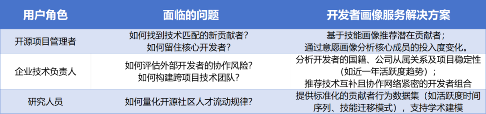
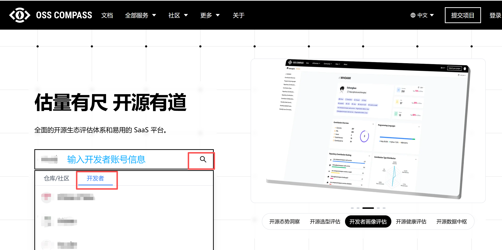
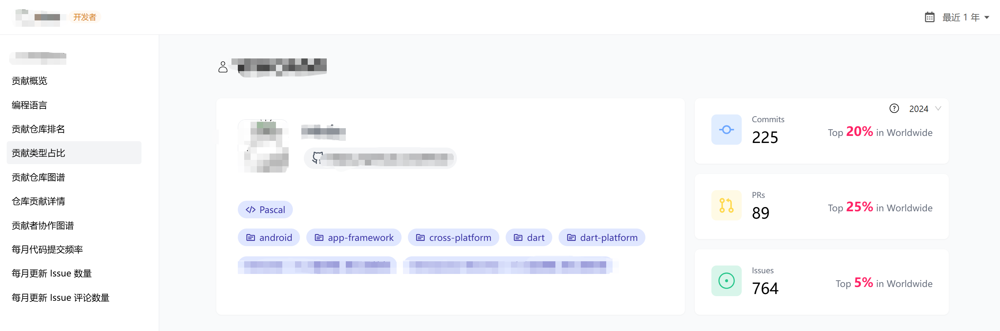
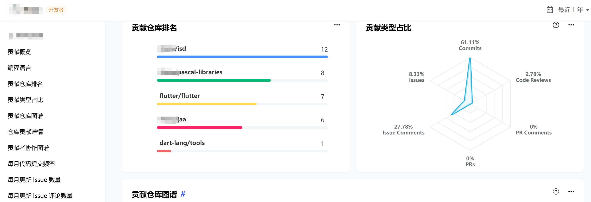
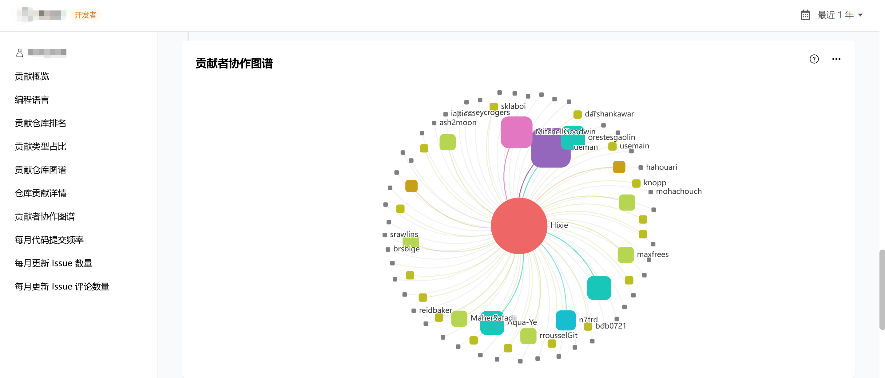
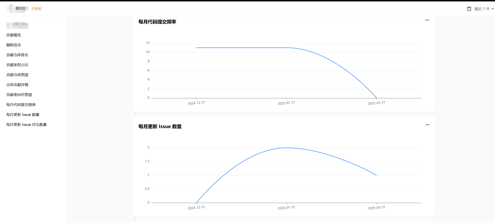

# 开发者画像评估服务

在开源生态蓬勃发展的当下，开发者作为核心驱动力，其行为模式、技术能力与协作倾向的洞察成为项目可持续发展的关键。OSS-Compass 社区推出的 "开发者画像评估服务"，依托数据驱动的多维建模体系，为开源项目管理者、企业技术团队及研究人员提供精准的开发者能力评估，助力发掘高价值贡献者、优化开源协作效率。

## 功能特点

**1. 数据基础**

服务依托 OSS-Compass 开源数据中枢，整合以下数据源：
- GHArchive 数据集：抓取 GitHub 全量历史事件（Commit、PR、Issue 等）。项目活动数据：通过 GitHub API 获取目标项目及关联项目的用户行为记录。
- 用户属性信息：包括开发者的编程语言偏好、项目经验、所属组织等结构化数据。
- 采用 "滚雪球法" 构建贡献者网络：以初始 "种子" 项目为起点，扫描活跃用户的全项目活动事件，逐步扩展相关用户池，形成覆盖千万级开发者的行为数据库。

**2. 构建双维度画像体系**

**技能画像：技术能力量化评估**
- 技术栈匹配度：分析开发者的编程语言使用占比、API / 库经验及项目参与历史，计算与目标项目的技术契合度。
- 活跃度与影响力：统计 Commit、PR、Issue 等事件数量，结合全球排名，评估其在开源社区的生产力。
- 项目角色识别：区分 "组织管理者""访客贡献者""个人开发者" 等角色。

**意愿画像：协作倾向深度分析**
- 情感倾向分析：通过自然语言处理技术，解析开发者在 Issue/PR 评论中的情感极性（正向 / 中性 / 负向）。
- 社交网络建模：构建开发者协作网络图，通过度中心性、介数中心性等指标评估其在社区中的枢纽作用。
- 跨项目投入分布：对比开发者在目标项目与其他项目的活动占比，预测其加入新社区的可能性。

开发过程中的许多角色，都可以通过该功能解决问题：

## 操作指导

**Step1：** 首先，访问 OSS-Compass 官网：[https://oss-compass.org](https://oss-compass.org)，在首页输入框中填入开发者 GitHub 账号地址（如: Hixie），点击 "开发者名称" 获取画像报告。

**Step2：** 开发者画像服务生成包含以下模块的报告：

- **基本信息：** 开发者基本信息, 所属组织, 所属国家; 活跃度排名（如 Commits 全球前 20%、Issues 全球前 5%）、技术栈分布。
- **项目贡献详情：** 各仓库角色（组织管理者 / 组织参与者/个人关联者/个人参与者）、贡献类型占比。
- **贡献者协作网络：** 当前开发者与其他开发者之间的协作关系图。
- **时间序列分析：** 近一年每月 Code Commit 频率、Issue 更新数量等趋势图。

