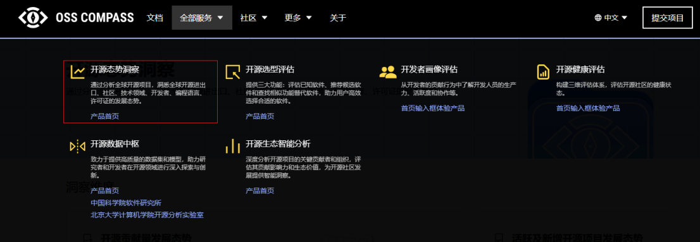
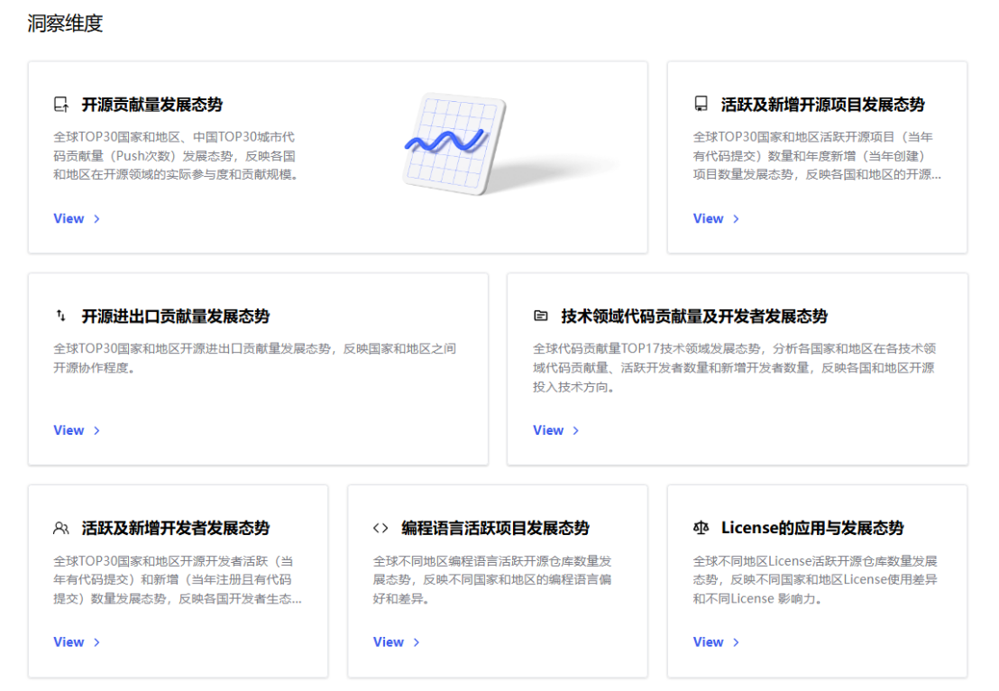
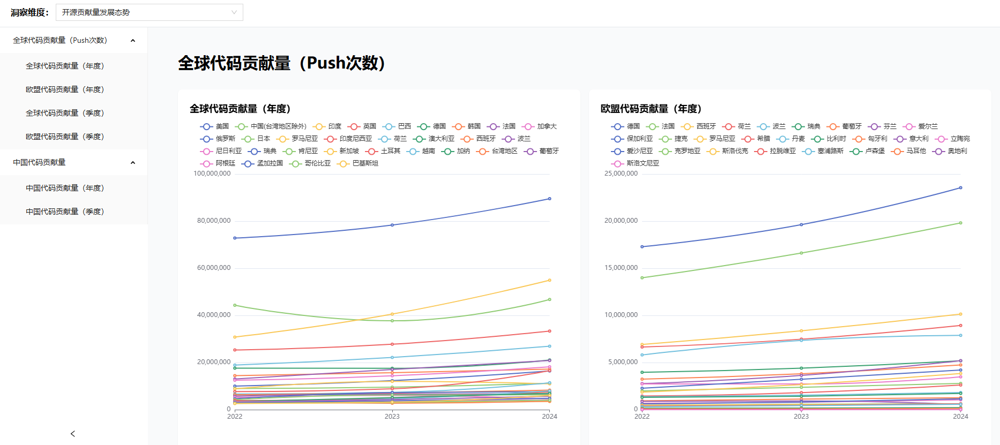
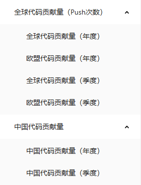
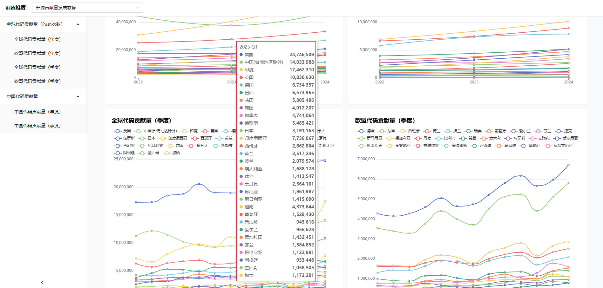

# 开源态势洞察服务

开源态势洞察服务通过分析全球开源项目与开发者数据，洞悉全球开源进出口、社区、技术领域、开发者、编程语言、许可证等维度发展态势；主要数据来源于GitHub和Gitee国际和国内两大代码托管平台，包含 2022 年至2025年的开源项目与开发者数据等数据，数据样本量规模达到亿级。主推服务为开源贡献量发展态势、开源进出口贡献量发展态势、技术领域代码贡献量及开发者发展态势，所有服务介绍如下：

1. **开源贡献量发展态势** 全球TOP30国家和地区、中国 TOP30 城市代码贡献量（Push次数）发展态势，反映各国和地区在开源领域的实际参与度和贡献规模。

2. **活跃及新增开源项目发展态势** 全球TOP30国家和地区活跃开源项目（当年有代码提交）数量和年度新增（当年创建）项目数量发展态势，反映各国和地区的开源创新活力与持续发展能力。

3. **开源进出口贡献量发展态势** 全球 TOP30 国家和地区开源进出口贡献量发展态势，反映国家和地区之间开源协作程度。

4. **技术领域代码贡献量及开发者发展态势** 全球代码贡献量TOP17技术领域发展态势，分析各国家和地区在各技术领域代码贡献量、活跃开发者数量和新增开发者数量，反映各国和地区开源投入技术方向。

5. **活跃及新增开发者发展态势** 全球 TOP30 国家和地区开源开发者活跃（当年有代码提交）和新增（当年注册且有代码提交）数量发展态势，反映各国开发者生态差异和趋势。

6. **编程语言活跃项目发展态势** 全球不同地区编程语言活跃开源仓库数量发展态势，反映不同国家和地区的编程语言偏好和差异。

7. **License的应用与发展态势** 全球不同地区License活跃开源仓库数量发展态势，反映不同国家和地区License使用差异和不同License 影响力。

## 功能特点

**1. 多维度全球态势分析**
覆盖六大核心维度：开源项目进出口贸易、社区协作模式、技术领域演进、开发者生态分布、编程语言偏好、许可证合规动态，形成全景式开源生态图谱。数据融合双平台：整合GitHub（国际）与Gitee（国内）亿级项目与开发者数据，目前时间跨度为2022-2025年，后续会持续更新最新数据，确保样本覆盖广度与时效性。

**2. 动态贡献量化评估**
贡献规模可视化：监测全球TOP30国家/地区及中国TOP30城市的代码Push频次，精准反映区域开源参与度；追踪活跃项目与新增项目数量，衡量开源创新持续性。开发者生态诊断：分析活跃开发者与新增开发者的规模变化，揭示区域人才储备趋势。

**3. 开源协作网络透视**
进出口贡献量映射：通过跨国代码协作数据，量化TOP30国家/地区间的开源依赖关系与协作紧密度，识别核心技术枢纽与边缘节点。

**4. 技术领域深度洞察**
技术赛道竞争力分析：聚焦全球TOP17技术领域，对比各国代码贡献量、开发者数量及增长率；提供领域内技术路线图，辅助政策与投资决策。

**5. 技术偏好与合规监控**
语言生态图谱：关联地域与编程语言活跃仓库数据，揭示区域技术栈差异。License影响力评估：监测主流许可证（MIT、GPL、Apache等）的区域采纳率与合规风险，预判开源治理趋势。

## 操作指导

**Step1：** 首先，访问 OSS-Compass 官网：[https://oss-compass.org](https://oss-compass.org)，点击导航栏的"全部服务"，选择开源洞察洞察，按需订阅七大洞察维度。

**Step2：** 订阅洞察维度

进入开源态势洞察主页后，您将看到七个不同的洞察维度。根据您的需求，选择并查看您感兴趣的洞察维度。

**Step3：** 进入具体维度页面

例如，点击"开源贡献量发展态势"维度，您将进入该维度的专属页面。

**Step4：** 使用左侧菜单栏

在左侧菜单栏中，您可以选择具体的指标，如：
- 洞察地区：选择您关注的地理区域，如中国或者欧盟。
- 洞察时间：选择您关注的时间范围，包括季度数据和年度数据。

**Step5：** 查看数据图表

页面右侧将展示对应的具体数据图表。鼠标悬浮在图表上，您将能够查看更详细的数据详情，例如国家和地区具体数值、时间点等信息。

