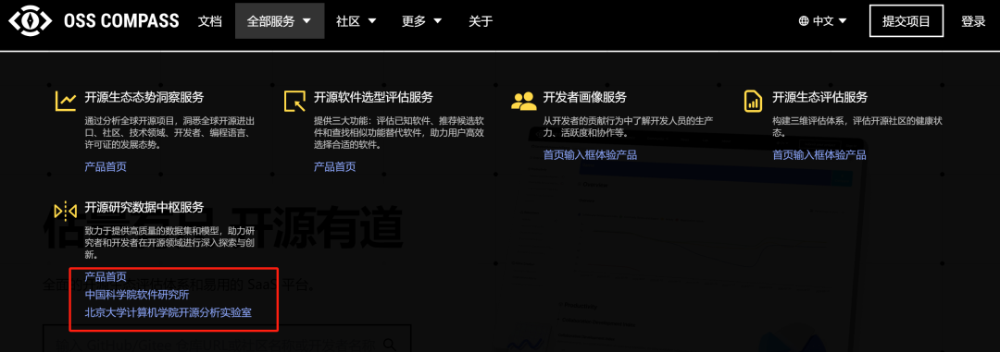
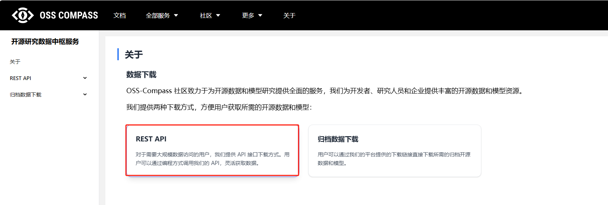
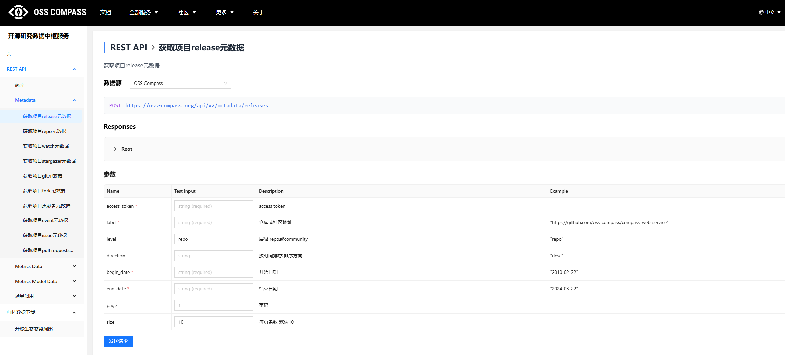
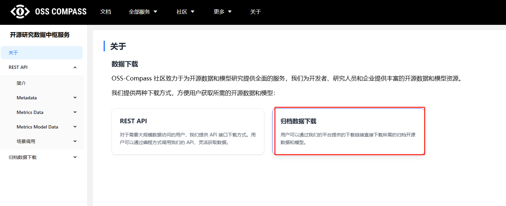
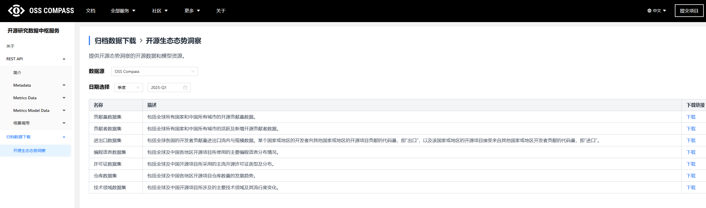

# 开源研究数据中枢

为进一步降低数据获取门槛、加速开源研究落地，OSS-Compass 推出了"开源研究数据中枢服务"，旨在构建一个高可用、高可信、高可拓展的数据获取平台。这项服务，不仅是一个数据提供工具，更是我们推动开源研究走向系统化、透明化与自动化的关键一步。

无论你是开发过程中的哪个角色，都可以通过使用该项服务获得便利：

- **研究人员：** 获取标准化历史数据复现实验或构建模型
- **开发者 / 平台方：** 通过 API 实时掌握开源项目动态
- **政策研究者 / 社区运营者：** 洞察开源生态结构与发展趋势
- **企业研发管理者：** 分析自身在开源领域的参与度与影响力

## 功能特点

OSS-Compass 推出的"开源研究数据中枢服务"具备以下优势：

1. **统一接入方式：** 通过 REST API 和归档数据下载接口，提供标准化数据访问方式。

2. **丰富的数据资源：** 涵盖开源项目的 commit、issue、PR、release、star、组织活跃度等核心维度支撑指标建模与科研分析：可作为 CHAOSS 指标评估、影响力建模等工作的数据基础。

3. **促进学术与产业协同：** 帮助高校、研究机构和开源公司共享基础数据，推动开源治理与发展研究。

## 操作指导

**Step1：** 首先，访问 OSS-Compass 官网：[https://oss-compass.org](https://oss-compass.org)，点击导航栏的"全部服务"，可在弹框中选择"开源研究数据中枢服务"产品首页，或镜像站：中国科学院软件研究所、北京大学计算机学院开源分析实验室（点击任意一个即可），进入开源研究数据中枢服务首页。

**Step2：** 通过 REST API 获取数据

在服务首页点击"REST API"进入详情页面, 你可以在此页面查阅接口认证方式、所有支持的接口、参数说明、示例请求与响应格式。

**Step3：** 通过归档数据下载数据包

在服务首页点击"归档数据下载"进入下载页面，在此页面可以选择下载季度或者年度开源生态态势洞察归档数据。

