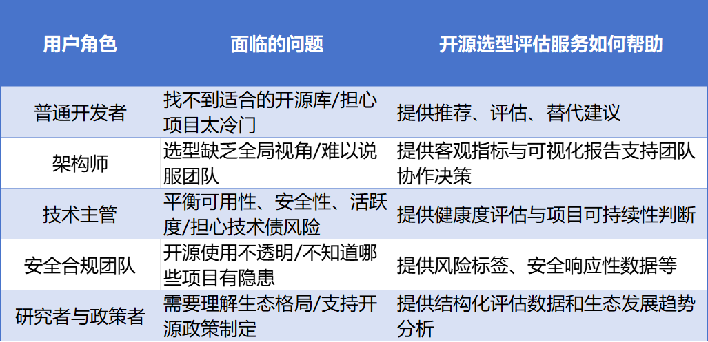
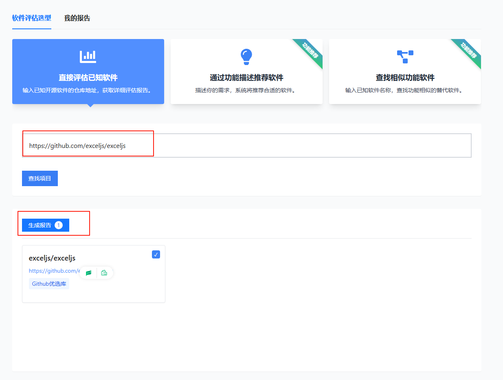
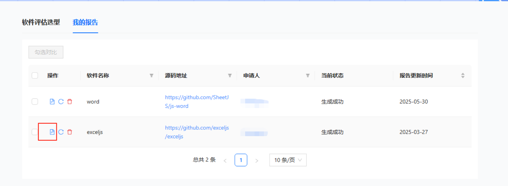
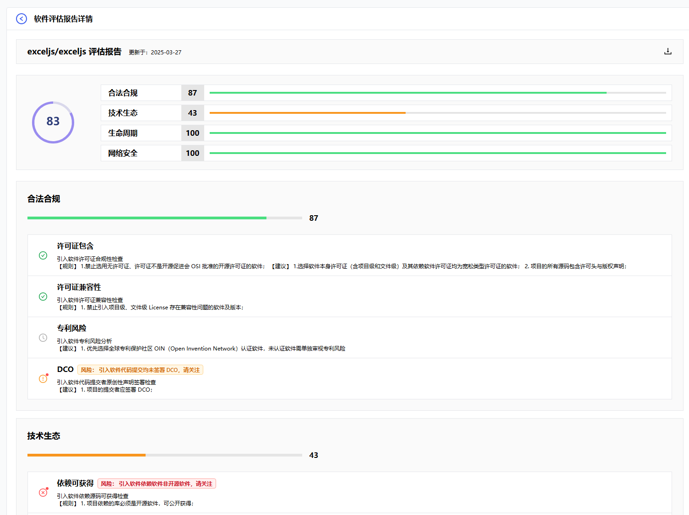
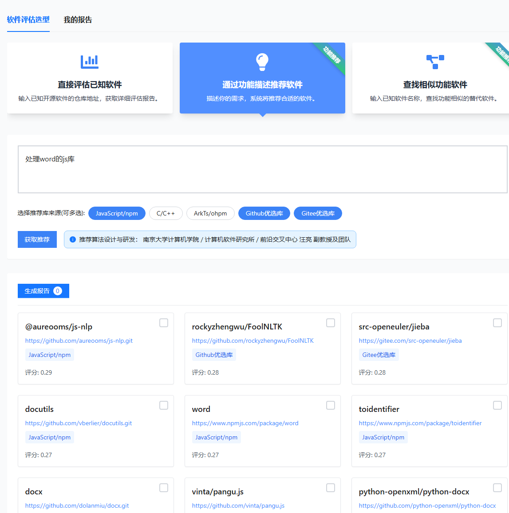
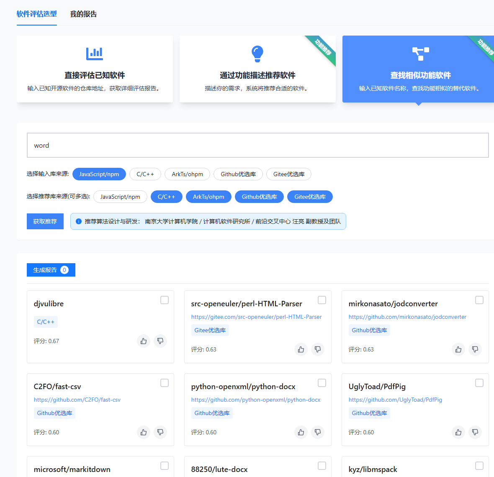

# 开源软件选型评估服务

OSS-Compass 社区推出的"开源选型评估服务"，构建一个数据驱动、可量化、具可比性的选型支撑体系，让"选型"从主观经验驱动转变为指标与数据驱动的智能决策过程。

## 功能特点

我们围绕开源软件选型过程中最常见的三类问题，设计了三大核心功能：

1. **评估已知开源软件**
   如果想知道具体项目值不值得用？输入 GitHub/Gitee 地址，系统自动生成一份包含合法合规、技术生态、生命周期、网络安全这四个维度的报告。

2. **基于功能描述的软件推荐**
   用户只需描述"想做什么"，输入自然语言功能描述（如"处理Excel的JS库"），系统即利用大模型（如 DeepSeek）对项目文本信息进行摘要生成，使用翻译模型和词频增强，构建多语言、高覆盖的关键词向量；查询时大模型理解用户意图，提取核心语义；最终通过向量语义相似度与 BM25 关键词匹配综合打分，完成推荐排序，输出 Top-N 个最相关的开源项目推荐。

3. **查找功能相似的替代软件**
   当用户想要找到当前使用工具的相似替代方案，只需输入当前使用的三方库地址，系统即利用大模型基于其描述与关键词构建查询项，输出 Top-N 个功能近似的替代项目。

开发过程中的许多角色，都可以通过该功能解决问题：

## 操作指导

**Step1：** 首先访问我们的官网：[https://oss-compass.org](https://oss-compass.org)，点击导航栏的"全部服务"，可在弹框中点击"开源选型评估"，进入开源选型评估服务首页。

**Step2：评估已知开源软件**

在输入框输入项目地址，点击查找项目，搜索结果将会在下方呈现，勾选后即可生成报告，点击"我的报告"进入报告列表，点击报告图标可进行查看报告详情。

**Step3：通过功能描述推荐软件**

在输入框中输入需求，例如"处理word的js库"，再选择推荐来源，可多选，点击获取推荐，结果将会在下方呈现。

**Step4：查找相似功能软件**

在输入框中输入已知软件名，选择输入库来源，再选择推荐库来源即可获取推荐。

